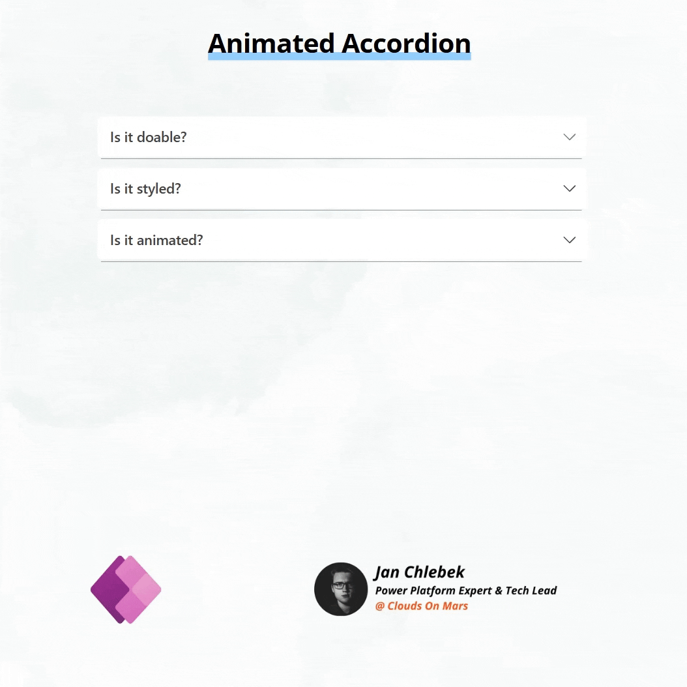
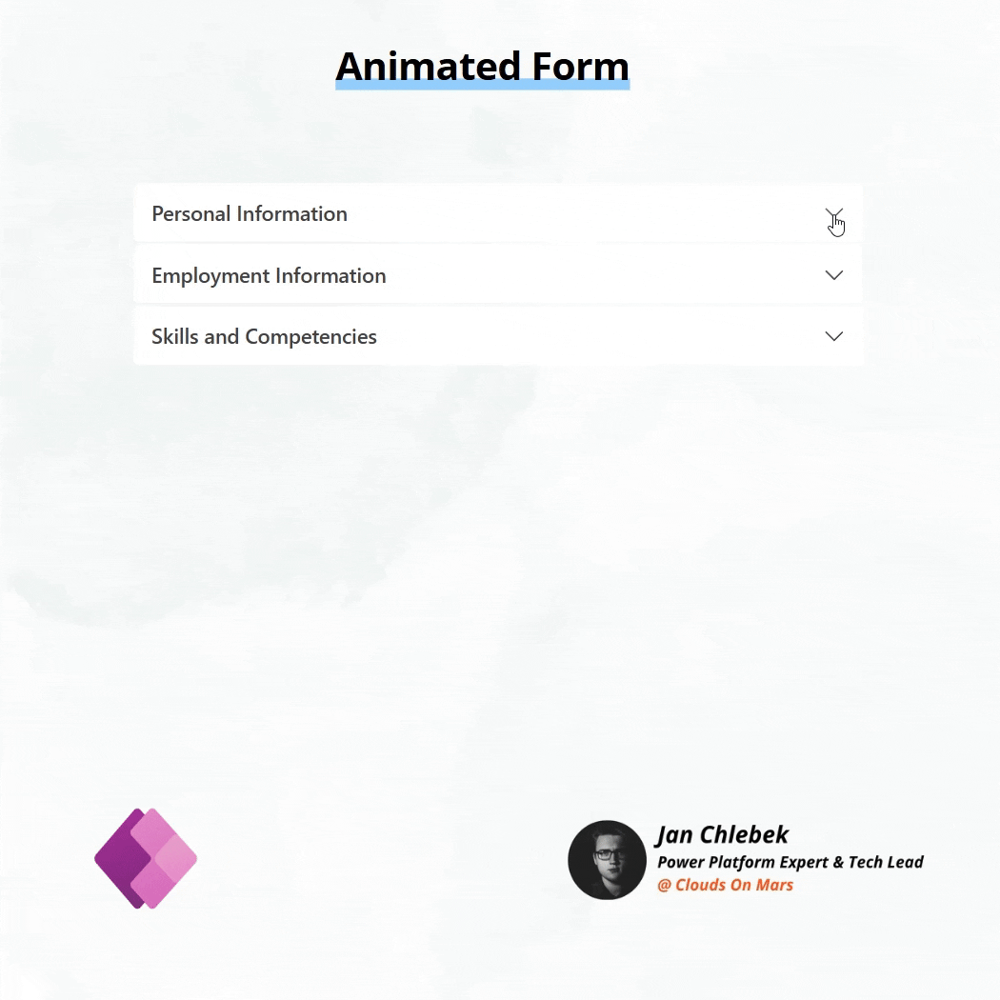

# Animated Accordions

Animated accordion component implemented using native components in Power Apps Canvas. Great for FAQ, navigation menus, interactive forms and any other foldable UI objects that require content organization.

### Animated Accordion
Basic accordion dedicated for FAQ content. Row items are dynamically generated on Gallery items, all content is passed directly to text fields.

### Animated Form
Manualy build container set, build on top of the idea of animated accordion. Can scale to any numer of items. Freat for building forms and menus.

## Authors

Author|Socials
--------|---------
Jan Chlebek | [LinkedIn](https://www.linkedin.com/in/jan-chlebek/) - ([GitHub](https://github.com/jan-chlebek) )

## Minimal path to awesome

1. Open your Power App in edit mode
2. Copy the contents of either the **[animated-accordion.pa.yaml](./source/animated-accordion.pa.yaml)** or **[animated-form.pa.yaml](./source/animated-form.pa.yaml)**  depending on your preference
3. Right-click on the screen where you want to add the snippet and select `Paste`

## Disclaimer

**THIS CODE IS PROVIDED *AS IS* WITHOUT WARRANTY OF ANY KIND, EITHER EXPRESS OR IMPLIED, INCLUDING ANY IMPLIED WARRANTIES OF FITNESS FOR A PARTICULAR PURPOSE, MERCHANTABILITY, OR NON-INFRINGEMENT.**

