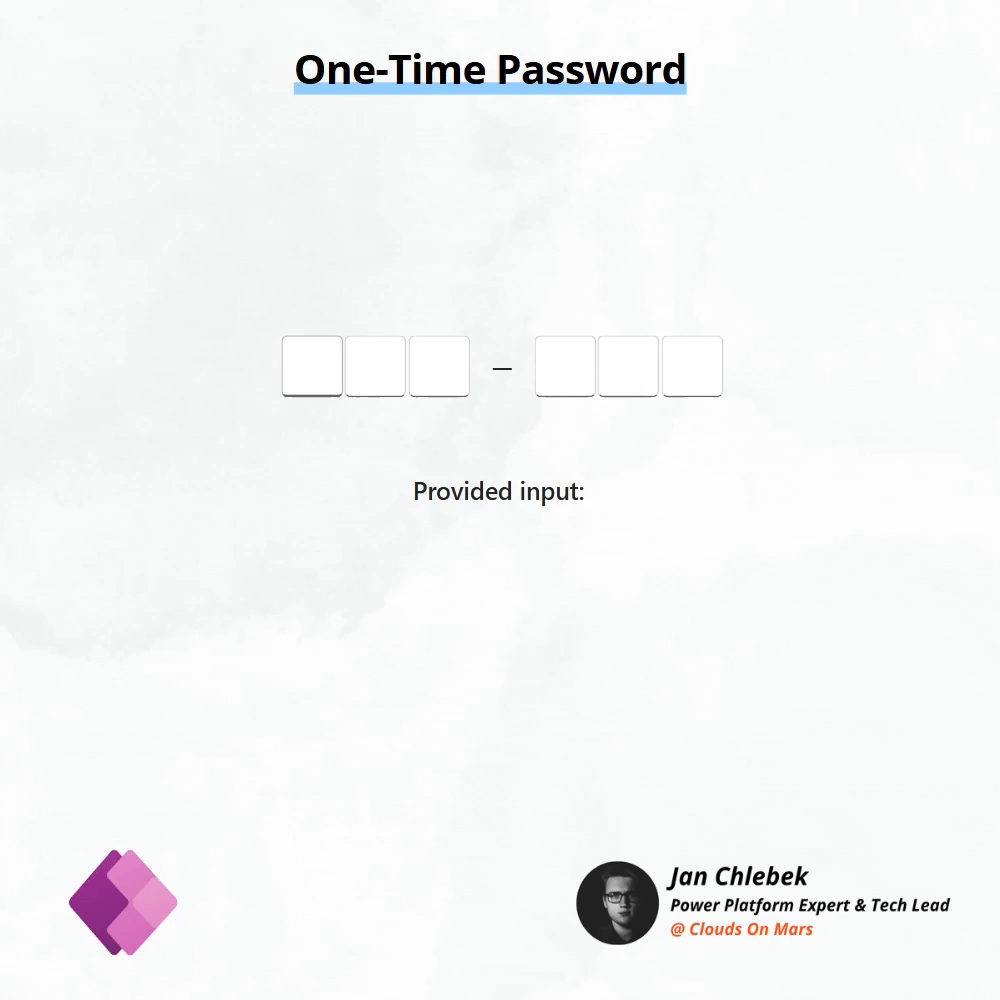

# One-Time Password Input

A secure and user-friendly one-time password (OTP) input control implemented using native Power Apps Canvas components. As authentication isn't something widely used, this one is definitely atypical control. Suggested usages are especially suited for gamification of your power apps or specific live audience interactions, such as educational purposes like quizzes.

Implementation of these controls posed a few challenges to figuring out the best possible approach:
- the ability to have focus set during input (SetFocus function) was considered a must-have, which made it impossible to implement snipped either using gallery or components
- control was supposed to be UI optimized and react on a given keypress, which made it not feasible for standard control without building an onKeyPress event for each input control based on the slider control which is too "hacky" solution for a reusable snippet
- as modern controls don't have OnSelect property clearing it out was a bit tricky. As a compromise a mechanism that clears each subsequent input was implemented. In some cases, a better UI approach would be to add clear all button

## Authors

Author|Socials
--------|---------
Jan Chlebek | [LinkedIn](https://www.linkedin.com/in/jan-chlebek/) - ([GitHub](https://github.com/jan-chlebek) )

## Minimal path to awesome

1. Open your Power App in edit mode
2. Copy the contents of either the **[otp-input.pa.yaml](./source/otp-input.pa.yaml)**
3. Right-click on the screen where you want to add the snippet and select `Paste`

## Disclaimer

**THIS CODE IS PROVIDED *AS IS* WITHOUT WARRANTY OF ANY KIND, EITHER EXPRESS OR IMPLIED, INCLUDING ANY IMPLIED WARRANTIES OF FITNESS FOR A PARTICULAR PURPOSE, MERCHANTABILITY, OR NON-INFRINGEMENT.**

